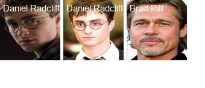
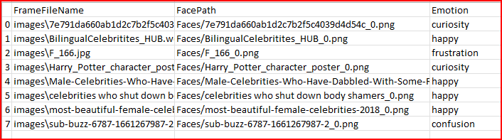
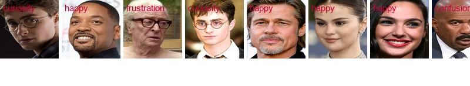
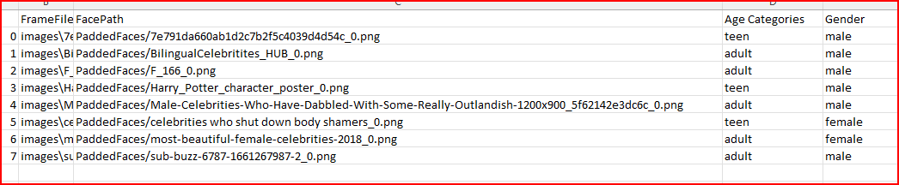
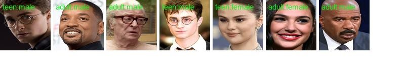

# CLIP model Applications
[CLIP](https://github.com/openai/CLIP) is a powerful model for image classification. There are numerous applications of CLIP model.
This repository contains some following applications. In the future we will keep on adding the applications.

## Applications
* Detecting Celebrities
* Detecting Face Emotions
* Detecting Age and Gender categories 

Above applications are depended on the faces extracted from the image
### Face Detection
The faces are detected using [retinaface](https://github.com/serengil/retinaface) model.
* FA1, FA2, FA3 and FA4 are the coordinates of the bounding boxes of the detected faces
* FrameFileName : Input image
* PaddedFacesPath : Extracted faces with some padding


### Detecting Celebrities
The extracted faces and the list of celebrities are passed to the CLIP model to predict the celebrities.
```
python identifyCelebrity.py --images_folder "images_folder"
```
### Details
* The celebrity lists are already saved in celebrityList.py file (Location: prompts folder).
* If you want to add the names of additional celebrities or edit the file. You can always do that.

### Output


### Detecting Face Emotions
The extracted faces and the list of prompts containing the emotions are passed to the CLIP model to predict the emotions.
```
python detectEmotions.py --images_folder "images_folder"
```
### Details
* The prompts are saved in emotionPrompts.py file (Location: prompts folder).
* If you want to add the names of additional emotions or edit the file. You can always do that.

The output of the model has been saved in following format


### Output


### Detecting Age Gender Categories
The extracted faces and the list of prompts containing the age and gender are passed to the CLIP model to predict the age and gender.
```
python ageGenderCategories.py --images_folder "images_folder"
```
### Details
* The prompts are saved in ageGenderPrompts.py file (Location: prompts folder).
* If you want to add the names of additional emotions or edit the file. You can always do that.

The output of the model has been saved in following format


### Output



